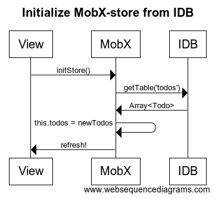
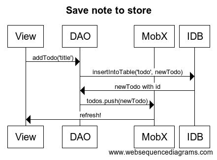

# mobx-idb-react-todo-app

- [MobX](https://mobxjs.github.io/mobx)
- [React](https://facebook.github.io/react).
- [IndexedDB](https://developer.mozilla.org/en-US/docs/Web/API/IndexedDB_API)
- Supports ES6 and JSX compilation through babel.

# Development

- `npm install`
- `npm start`

# Two stores:

- MobX holds a store that is observable and React components are automatically re-rendered
- Indexedb is persistent store in the browser

## Initializing MobX from Indexdb

[src/models/IDBObservableTodoStore.js](src/models/IDBObservableTodoStore.js)

```
@task async fetchTodos () {
  await getTable('todos')
    .then(action(todos => this.todos.replace(todos)))
  }
```



[src/models/IDBObservableTodoStore.js](src/models/IDBObservableTodoStore.js)

```
@action
async addTodo(title) {
  const newTodo = await insertIntoTable('todos', new TodoModel(title))
  console.log("new todo:", newTodo)
  this.todos.push(newTodo)
}
```



### Issues

- Now it's easy to get MobX and IndexedDB out of sync
  - Example:
  - `onChange={() => (todo.finished = !todo.finished)}`
  - this code updated to store in MobX but not the indexdb
  - all updates should be done via DAO! Same as dispatching actions in redux

Next?

Ideally the IndexedDB (Dexie) would be observable by it self
-> one store in the browser
  - persistency
  - indexes
  - web standard (vs a library)
  - existing solutions for backend sync

EDIT: Added dexie-observable. Now dexie updates are detected!
- Still problem with updates to MobX state. But!
- Allow updates only to Dexie? Then propagate those to MobX
- MobX for easy use of observables
- => flux pattern?

Still mismatch between indexdb data schemas and relational?
- relational vs keyvalue

But key-value can be limited to relational with certain constraints...

